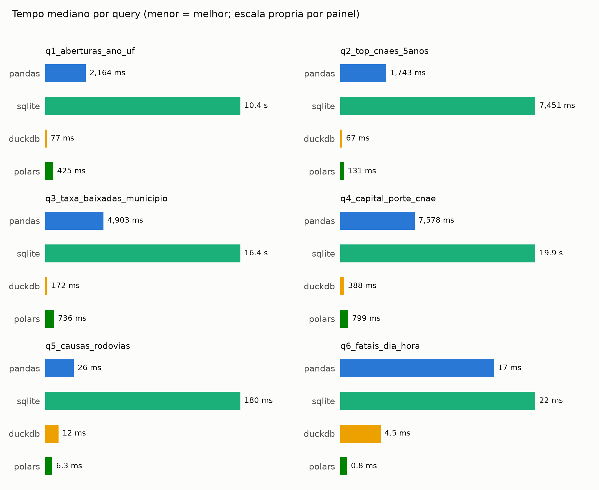
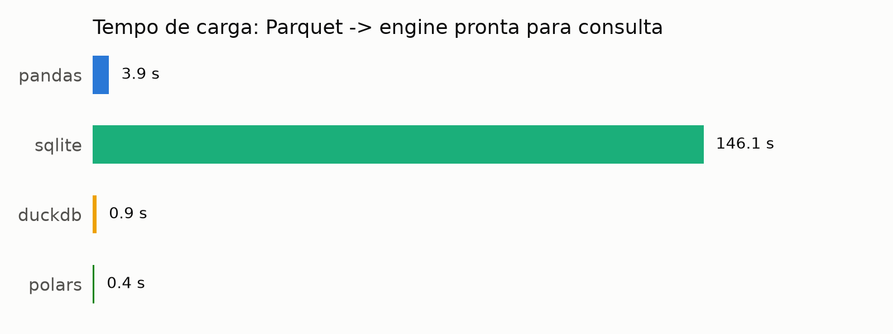
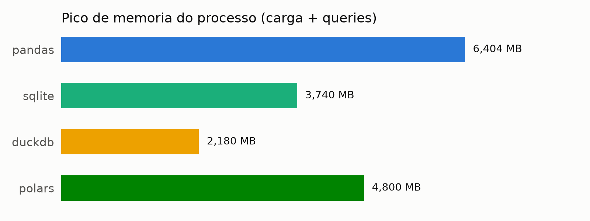

# Benchmark de Engines de Dados sobre Datasets Públicos do Brasil

Comparação rigorosa e reproduzível de **Pandas, SQLite, DuckDB e Polars** executando
as mesmas 6 queries analíticas sobre dois datasets públicos brasileiros de verdade:

- **Cadastro Nacional de Empresas (CNPJ)** — a Receita Federal publica gratuitamente,
  todo mês, o cadastro completo de todas as empresas do Brasil (mais de 60 milhões).
  Pouca gente sabe que isso existe. Aqui usamos um recorte de SP, RJ, MG e BA.
- **Acidentes em rodovias federais (PRF)** — ocorrências registradas pela Polícia
  Rodoviária Federal, 2022–2024.

Sem dataset de tutorial, sem dado sintético: os números medem as engines contra o
atrito de dados reais de governo — CSV sem cabeçalho, encoding ISO-8859-1, vírgula
como separador decimal e formato de data que muda entre anos.

## Resultados

Dataset CNPJ: **15,7 milhões de estabelecimentos** e **6,5 milhões de empresas**
(recorte SP/RJ/MG/BA da parte 0); PRF: **205 mil acidentes** (2022–2024).







### Destaques

| Métrica | Resultado |
|---------|-----------|
| Carga (Parquet → pronta p/ consulta) | Polars 0,4 s · DuckDB 0,9 s · Pandas 3,9 s · **SQLite 146 s** |
| Query mais pesada (join 15,7M × 6,5M, q4) | DuckDB 388 ms · Polars 799 ms · Pandas 7,6 s · SQLite 19,9 s |
| Agregação com data (q1) | DuckDB 77 ms · Polars 425 ms · Pandas 2,2 s · SQLite 10,4 s |
| Pico de memória (carga + queries) | DuckDB ~1,8 GB · Polars ~2,2 GB · Pandas ~2,8 GB · SQLite ~3,7 GB |

O que os números contam:

- **DuckDB venceu todas as queries analíticas** — execução vetorizada e colunar
  fazem 20–135× a diferença sobre SQLite no mesmo hardware, com a mesma semântica SQL.
- **Polars carregou mais rápido** que todas (Parquet nativo + lazy) e ficou
  consistentemente em segundo nas queries.
- **SQLite pagou caro duas vezes**: na carga (146 s inserindo linha a linha) e nas
  queries analíticas (armazenamento orientado a linha). Não é o trabalho para o
  qual ele foi desenhado — e o benchmark mostra exatamente o quanto isso custa.
- **Pandas segurou o meio de campo**, mas a q6 expõe uma dor real: sem tipo nativo
  para hora-do-dia, a extração da hora cai em `.map()` objeto a objeto — Polars fez
  a mesma query 20× mais rápido.

Máquina dos testes: AMD Ryzen 5 5600G, 16 GB RAM, SSD, Windows 10 Pro ·
Python 3.12 · pandas 3.0.3 · polars 1.42.1 · duckdb 1.5.4 · SQLite 3.49.

## Por que essas engines

| Engine | O que representa |
|--------|------------------|
| Pandas | o baseline que todo mundo usa por padrão |
| SQLite | banco relacional embutido clássico, linha a linha |
| DuckDB | engine analítica colunar e vetorizada moderna |
| Polars | dataframes em Rust com execução lazy |

Todas rodam **embutidas no processo** (sem servidor), o que torna a comparação justa
e o benchmark reproduzível em qualquer máquina.

## As 6 queries

| # | Query | Padrão que exercita |
|---|-------|---------------------|
| 1 | Aberturas de empresas por ano e UF desde 2000 | agregação + extração de data |
| 2 | Top 10 atividades econômicas dos últimos 5 anos | join + group by + top-k |
| 3 | Municípios com maior taxa de empresas baixadas | agregação condicional + having |
| 4 | Capital social médio por porte × divisão CNAE | join de 2 tabelas grandes |
| 5 | Causas de acidente por rodovia, por mortos | group by + ordenação |
| 6 | Dia da semana × hora dos acidentes fatais | extração de tempo |

## Metodologia

- **Corretude antes de velocidade**: antes de qualquer medição, as 6 queries rodam
  numa amostra e os resultados das 4 engines são comparados linha a linha
  (`run_benchmark.py --check`). Benchmark com resultado errado não vale nada.
- **Um subprocesso por engine** — medição de memória isolada, interpretador frio.
- **Carga medida separada da query**: "Parquet → engine pronta" é um custo pago uma
  vez e com perfil próprio.
- Cada query roda **5×**; a primeira execução (aquecimento) é descartada e
  reportamos a **mediana** das demais.
- **Memória** = pico de RSS do processo, amostrado a cada 50 ms.
- Ordenações com critério de desempate explícito, para comparação determinística
  entre engines.

## Atritos reais que o código enfrenta (e que você vai enfrentar também)

1. A RFB **desativou as URLs diretas antigas** de download: hoje os arquivos ficam
   num Nextcloud público (SERPRO+). O `download_data.py` navega o share via WebDAV
   (`PROPFIND`) e descobre sozinho o mês mais recente completo.
2. A RFB **não publica os dados por estado**: as tabelas grandes vêm fatiadas em 10
   partes arbitrárias. O recorte regional é feito localmente, após o parse.
3. CSVs do CNPJ: **sem cabeçalho**, `;` como delimitador, encoding **ISO-8859-1**,
   vírgula decimal no capital social e datas `AAAAMMDD` onde `0` significa nulo.
4. CSVs da PRF: o **encoding muda conforme o ano** (UTF-8 ou Latin-1) e o formato de
   data alterna entre `AAAA-MM-DD` e `DD/MM/AAAA`.

## Como reproduzir

```bash
pip install -r requirements.txt
python scripts/download_data.py     # baixa RFB (via WebDAV) e PRF  (~1,5 GB)
python scripts/prepare_data.py      # normaliza e converte p/ Parquet
python scripts/run_benchmark.py --check   # corretude na amostra
python scripts/run_benchmark.py     # benchmark completo
python scripts/make_charts.py       # gráficos em results/charts/
```

## Fontes e licenças dos dados

- [Dados Abertos do CNPJ — Receita Federal](https://arquivos.receitafederal.gov.br/)
  — dados públicos sob a Lei de Acesso à Informação.
- [Dados Abertos — Polícia Rodoviária Federal](https://www.gov.br/prf/pt-br/acesso-a-informacao/dados-abertos/dados-abertos-da-prf)
  — dados públicos do Governo Federal.

Os dados brutos não são versionados neste repositório (veja `.gitignore`); os
scripts baixam tudo das fontes oficiais.
